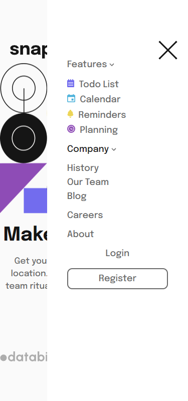

# Frontend Mentor - Intro section with dropdown navigation solution

This is a solution to the [Intro section with dropdown navigation challenge on Frontend Mentor](https://www.frontendmentor.io/challenges/intro-section-with-dropdown-navigation-ryaPetHE5). Frontend Mentor challenges help you improve your coding skills by building realistic projects. 

## Overview

### The challenge

Users should be able to:

- View the relevant dropdown menus on desktop and mobile when interacting with the navigation links
- View the optimal layout for the content depending on their device's screen size
- See hover states for all interactive elements on the page

#### Desktop Screenshot 🖥️

#### Active State 🖥️

#### Mobile Screenshot 📱

#### Mobile Screenshot 📱

### link 🔗

- Live Site URL: https://lkiryu.github.io/intro-section-with-dropdown-navigation/

### Built with 🛠️

- HTML5
- CSS
- JS
---
### Author 👨‍💻
 Made by Matheus Antonio